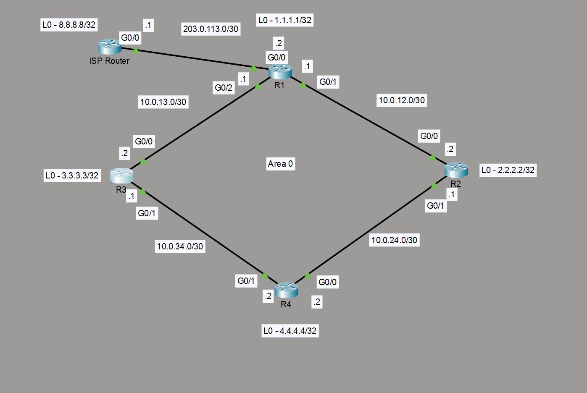
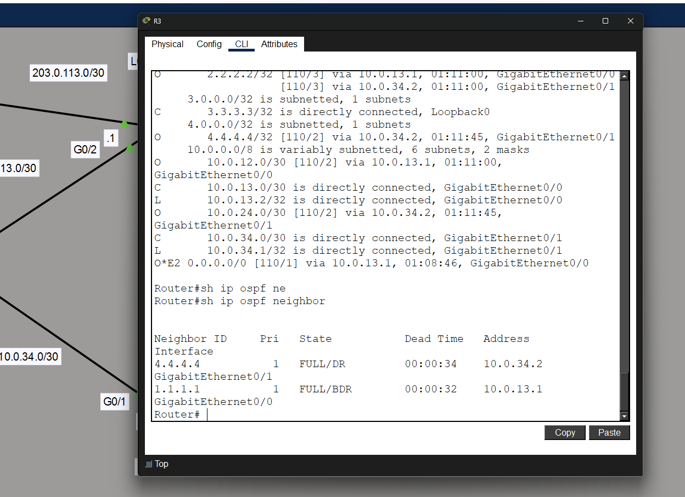
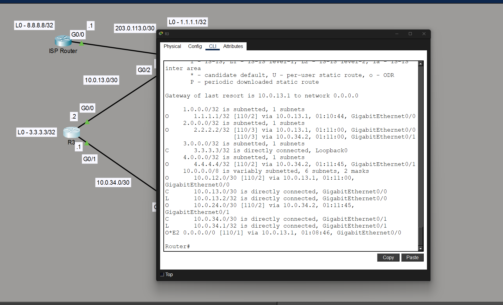
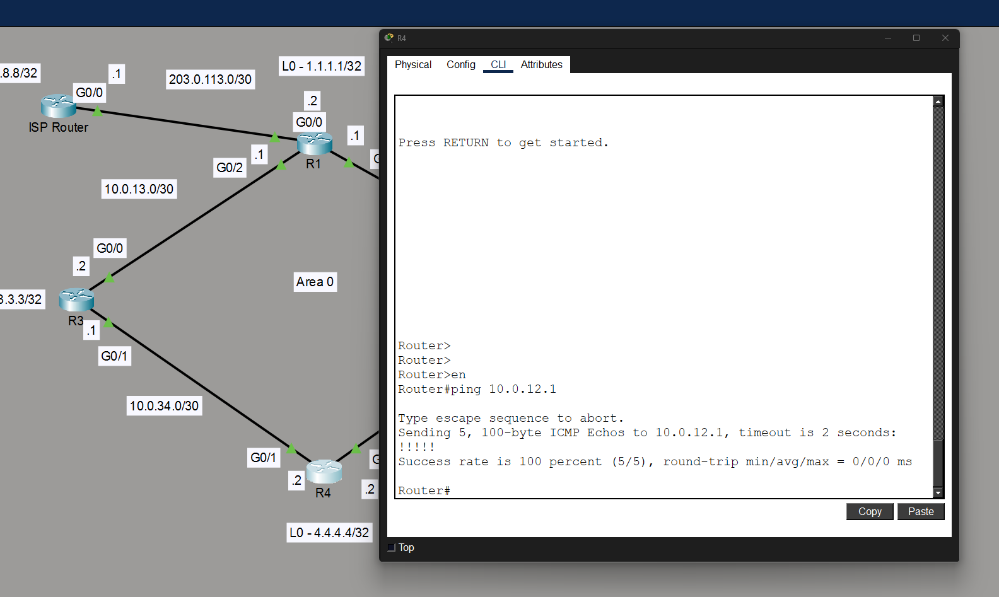
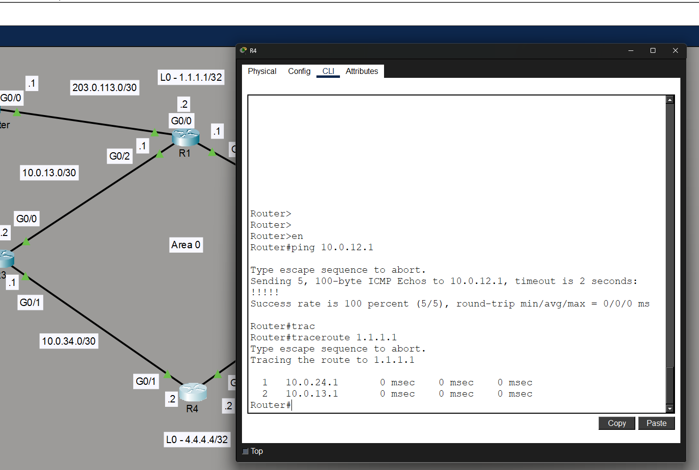

# OSPF Redundant Routing Lab

## Overview 

This project demonstrates the implementation of OSPF in a four-router topology with redundant paths and a simulated ISP to connect over.

The main objective was to estabilish OSPF adjacenves, and advertise routes dynamically while configuring a static route to an ISP while verifying end-end connectivity. 

## Technologies 

- Cisco IOS
- Packet Tracer
- OSPFv2
- Static Routing

## Topology 

## Verification

### OSPF Neighbors

Verified adjacencies were formed using the -show ip ospf neighbor- command 

### Routing Table

Verified routes using the -show ip route- command 

 

### Connectivity 

Lastly, verified connectivity end-to-end by using pings and traceroutes 

### Skills Demonstrated

- OSPF Configuration
- Dynamic Routing
- Cisco IOS Troubleshooting
- Route Advertisement 
- Network Documentation 
